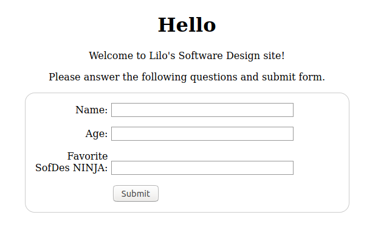
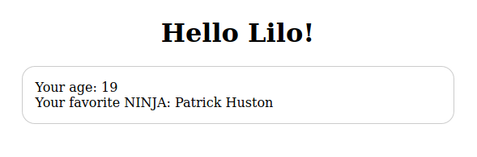

# Toolbox-Flask  
Web Apps Project Toolbox starter code

Full instructions on [the course website](https://sd2020spring.github.io/toolboxes/web-apps).  
This toolbox exercise was developed by [Patrick Huston](https://github.com/phuston).

To run this code, in command prompt:  
- Install flask: **pip install Flask**
- Run **python flask_app.py**
- Go to **[this link](http://localhost:5000/)**

Examples:  
 
